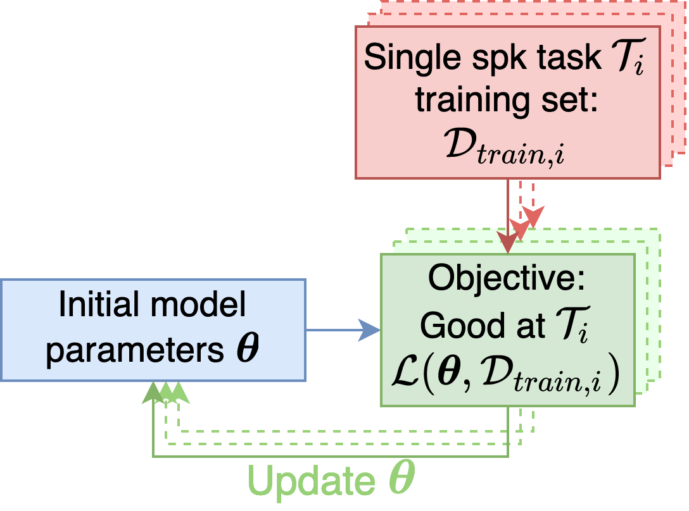
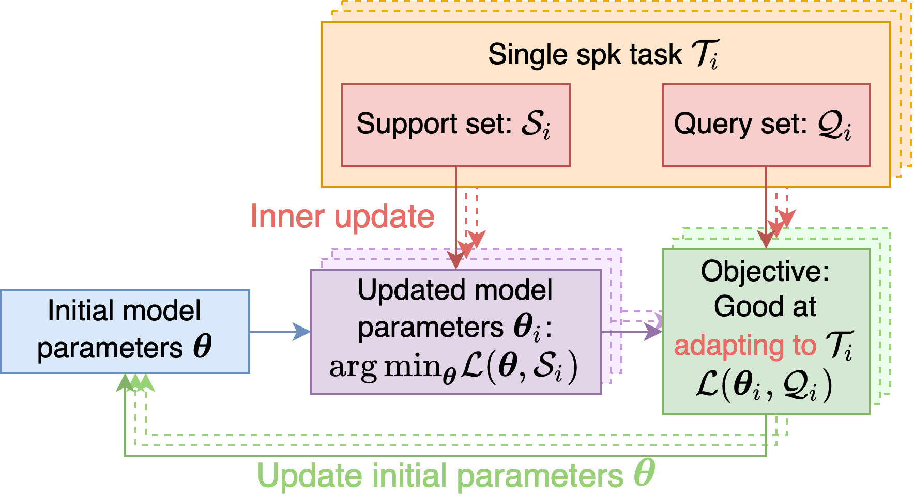

# Meta-TTS: Meta-Learning for Few-shot SpeakerAdaptive Text-to-Speech

This repository is the official implementation of "Meta-TTS: Meta-Learning for Few-shot SpeakerAdaptive Text-to-Speech".
<!--This repository is the official implementation of [Meta-TTS: Meta-Learning for Few-shot SpeakerAdaptive Text-to-Speech](https://arxiv.org/abs/2030.12345). -->

<!--📋  Optional: include a graphic explaining your approach/main result, bibtex entry, link to demos, blog posts and tutorials-->
- multi-task v.s. meta
| multi | meta |
| --- | --- |
|  |  |

- meta-TTS


## Requirements

This is how I build my environment, which is not exactly needed to be the same:
- Sign up for [Comet.ml](https://www.comet.ml/), find out your workspace and API key via [www.comet.ml/api/my/settings](www.comet.ml/api/my/settings) and fill them in `.comet.config`. Comet logger is used throughout train/val/test stages.
  - Check my training logs [here](https://www.comet.ml/b02901071/meta-tts/view/Zvh3Lz3Wvy2AiWcinD06TaS0G).
- [Optional] Install [pyenv](https://github.com/pyenv/pyenv.git) for Python version
  control, change to Python 3.8.6.
```bash
# After download and install pyenv:
pyenv install 3.8.6
pyenv local 3.8.6
```
- [Optional] Install [pyenv-virtualenv](https://github.com/pyenv/pyenv-virtualenv.git) as a plugin of pyenv for clean virtual environment.
```bash
# After install pyenv-virtualenv
pyenv virtualenv meta-tts
pyenv activate meta-tts
```
- Install [learn2learn](https://github.com/learnables/learn2learn.git) from source.
```bash
# Install Cython first:
pip install cython

# Then install learn2learn from source:
git clone https://github.com/learnables/learn2learn.git
cd learn2learn
pip install -e .
```
- Install requirements:
```bash
pip install -r requirements.txt
```

## Proprocessing
First, download [LibriTTS](https://www.openslr.org/60/) and [VCTK](https://datashare.ed.ac.uk/handle/10283/3443), then change the paths in `config/LibriTTS/preprocess.yaml` and `config/VCTK/preprocess.yaml`, then run
```bash
python3 prepare_align.py config/LibriTTS/preprocess.yaml
python3 prepare_align.py config/VCTK/preprocess.yaml
```
for some preparations.

Alignments of LibriTTS is provided [here](https://github.com/kan-bayashi/LibriTTSLabel.git), and
the alignments of VCTK is provided [here](https://drive.google.com/file/d/1ScLIiyIgLRIZ03DqCmrZ8F75miC77o8g/view?usp=sharing).
You have to unzip the files into `preprocessed_data/LibriTTS/TextGrid/` and
`preprocessed_data/VCTK/TextGrid/`.

Then run the preprocessing script:
```bash
python3 preprocess.py config/LibriTTS/preprocess.yaml

# Copy stats from LibriTTS to VCTK to keep pitch/energy normalization the same shift and bias.
cp preprocessed_data/LibriTTS/stats.json preprocessed_data/VCTK/

python3 preprocess.py config/VCTK/preprocess.yaml
```

## Training

To train the models in the paper, run this command:

```bash
python3 train.py -a <algorithm>
```

Available algorithms:
- base_emb_vad / base_emb_va / base_emb_d / base_emb
  - Baseline with embedding table.
- meta_emb_vad / meta_emb_va / meta_emb_d / meta_emb
  - Meta-TTS with embedding table.
- base_emb1_vad / base_emb1_va / base_emb1_d / base_emb1
  - Baseline with shared embedding.
- meta_emb1_vad / meta_emb1_va / meta_emb1_d / meta_emb1
  - Meta-TTS with shared embedding.

Note:
- **\*\_vad**: fine-tune embedding + variance adaptor + decoder
- **\*\_va**: fine-tune embedding + variance adaptor
- **\*\_d**: fine-tune embedding + decoder
- **without \*\_vad/\*\_va/\*\_d**: fine-tune embedding only

Please use 8 V100 GPUs for meta models, and 1 V100 GPU for baseline models, or
else you might need to tune gradient accumulation step (grad_acc_step) setting in
`config/*/train.yaml` to get the correct meta batch size.
Note that each GPU has its own random seed, so even the meta batch size is the
same, different number of GPUs is equivalent to different random seed.

After training, you can find your checkpoints under
`output/ckpt/LibriTTS/<project_name>/<experiment_key>/checkpoints/`, where the
project name is set in `.comet.config`.

To inference the models, run:
```bash
# LibriTTS
python3 test.py -a <algorithm> -e <experiment_key> -c <checkpoint_file_name>
# VCTK
python3 test.py -p config/VCTK/preprocess.yaml -t config/VCTK/train.yaml -m config/VCTK/model.yaml \
                -a <algorithm> -e <experiment_key> -c <checkpoint_file_name>
```
and the results would be under
`output/result/<corpus>/<experiment_key>/<algorithm>/`.

## Evaluation

`cd evaluation/` and check [README.md](evaluation/README.md)

## Pre-trained Models

Since our codes are using Comet logger, you might need to create a dummy
experiment by running:
```Python
from comet_ml import Experiment
experiment = Experiment()
```
then put the checkpoint files under
`output/ckpt/LibriTTS/<project_name>/<experiment_key>/checkpoints/`.

You can download pretrained models [here](https://drive.google.com/drive/folders/1Av7afSMcHX6pp2_ZmpHqfJNx6ONM7N8d?usp=sharing).

## Results

Speaker verification:
- same speaker v.s. different speaker
  - EER 
  - DET 
- real v.s. synthesized
  - Cosine similarity 
  - ROC 


<!--## Contributing-->

<!--📋  Pick a licence and describe how to contribute to your code repository. -->

